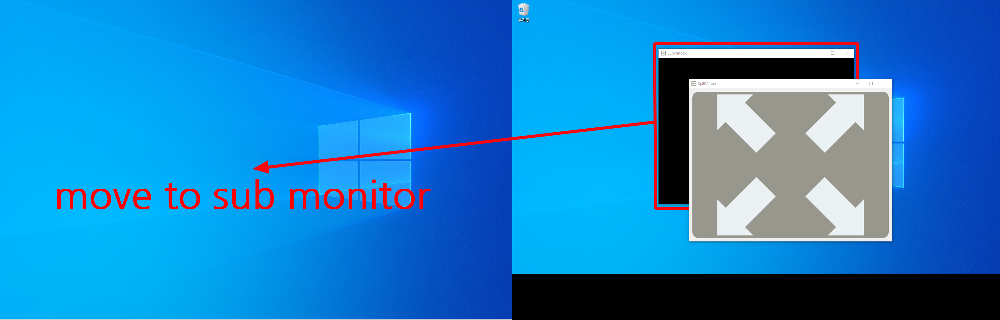
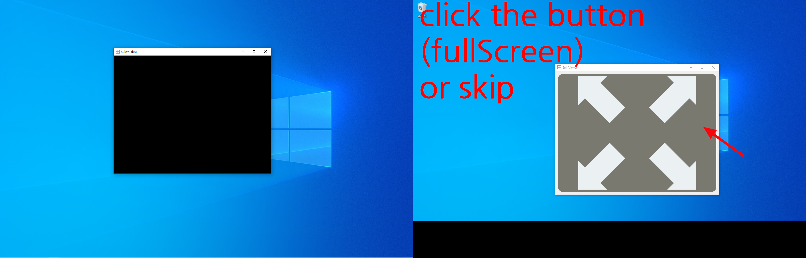
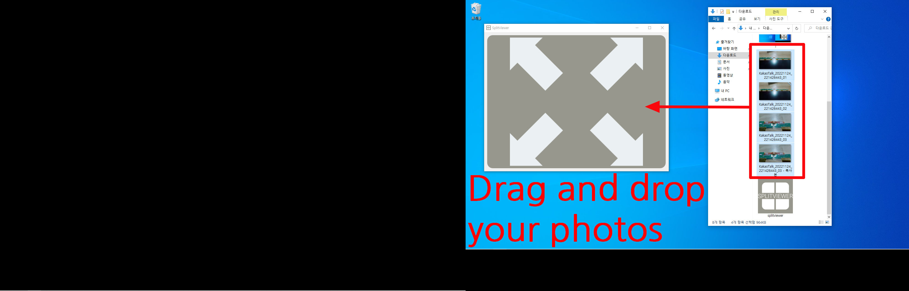
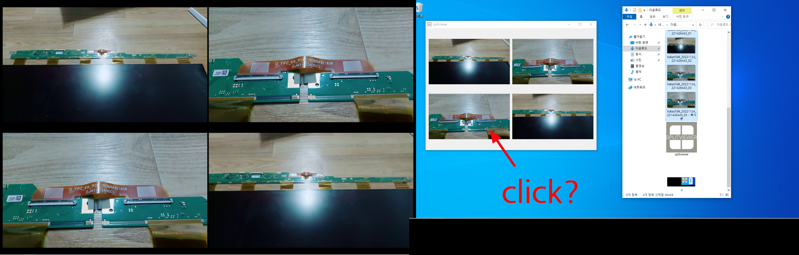
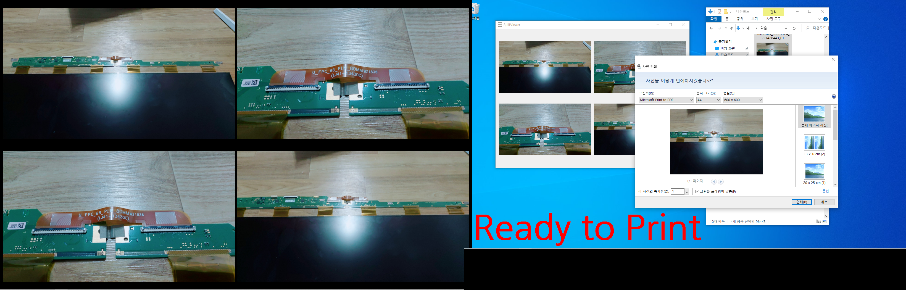

<h2>스플릿뷰어</h2>
스플릿뷰어는 테마파크등에서 촬영되는 기념사진을 고객이 보고 선택할수있게끔 하고자 만들어진 사진 뷰어 프로그램입니다.

<h2>설치및 사용</h2>
아래 다운로드 링크를 통하여 버전별로 다운을 받아 사용하실수있습니다.
 
<table>
<tr>
<td>v1.0</td>
<td><a href="https://mega.nz/file/ZO1HlCwZ#5tML3ZO0izE1sCemWba_4EJsKyl4HTdPYc7_q8ysNmU">download</a></td>
</tr>
</table>

<h2>시작하기</h2>
위 링크를 통해 다운받은 프로그램을 실행해주세요.
   

까만 배경색으로 칠해진 subWindow 를 보조모니터로 옮겨주세요.
한개모니터만 사용하시는경우 subWindow는 우측상단의 X 버튼을 눌러 닫아주시면됩니다.
   

mainWindow 중앙에 있는 버튼을눌러 subWindow 를 전체화면으로 만듭니다.
만약 전체화면이아니라 크기조절이가능한 상태로 사용하려는경우 누르지않아도됩니다.
   

전체화면버튼을 눌렀다면 이런식으로 고객에게 사진을 보여줄 준비가됩니다.
   

mainWindow 로 사진들을 드래그앤 드랍해주세요.
   

mainWindow 에 표시된 사진중 원하는 사진을 클릭하는경우
   

이런식으로 해당사진을 출력할수있도록 준비가되며, mainWindow 에 다시 다른 사진들을 올리는경우 기존 사진들은 없어지고 새로운 작업이 가능합니다.
   
